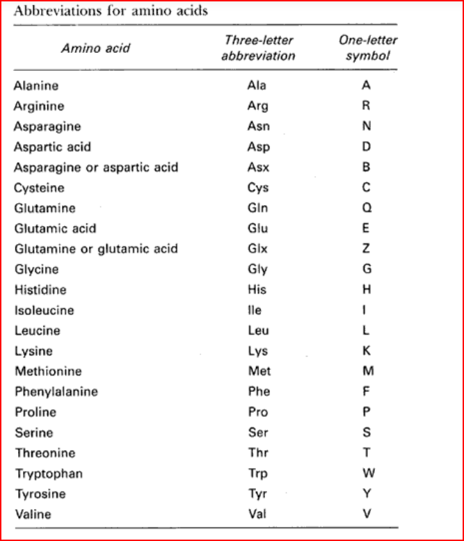

# Project Title

# The Problem
Peptides are short chains of amino acids that perform a wide range of biological functions, depending on the specific sequence of amino acids. Understanding how amino acids interact with other molecules is key to understanding the mechanisms of genetic diseases and to constructing therapies to address these diseases.
One form of interaction is the question of how well a peptide binds to a specific molecule (this is known as binding affinity). For this assignment, we will use a data set that includes a measure of binding affinity for a large number of peptides toward two molecules, known as HLA-DRB1*13:01 and HLA-DRB1*15:01. Our goal is to predict the binding affinity for novel peptides toward these molecules.

# Amino Acids
A total of 22 amino acids make up the building blocks for all peptides and proteins. The following table gives the names and one-letter codes used to represent these amino acids.

Each row in the CSV files contains two columns: a string representing the sequence of amino acids and a measure of
binding affinity. Each character of the string corresponds to a unique amino acid. Here is an example:

DLDKKETVWHLEE,0\
DKSKPKVYQWFDL,0\
HYTVDKSKPKVYQ,0\
KSKPKVYQWFDLR,0\
LHYTVDKSKPKVY,0\
TVDKSKPKVYQWF,0\
VDKSKPKVYQWFD,0\
YTVDKSKPKVYQW,0\
ADVILPIGTRSVETD,0.646144\
AFKPVLVDEGRKVAI,0.57075\
AGLKTNDRKWCFEGP,0.615622\
AHLAEENEGDNACKR,0\
ALYEKKLALYLLLAL,0.610019\
ANGKTLGEVWKRELN,0.495407

Note that different rows contain different numbers of amino acids.

The binding affinity is encoded on a log scale and ranges between 0 and 1. Peptides with affinities at or above 0.426 are considered more likely than not to bind to the molecule in question, whereas affinities below this threshold are considered less likely to bind.

# Performance Reporting
Once you have selected a reasonable architecture and set of hyper-parameters, produce the following figures:
1. Figure 1: Training set Area Under the Curve (AUC) as a function of epoch for each of the rotations (so, 5 curves)
    * If you are solving the binary prediction problem, use tf.keras.metrics.AUC() and set the threshold to 0.426
    * If you are solving the continous prediction problem, use MyAUC()
2. Figure 2: Validation set AUC as a function of epoch for each of the rotations
3. Figure 3: Training set Accuracy as a function of epoch for each rotation.
    * If you are solving the binary prediction problem, use tf.keras.metrics.BinaryAccuracy() and set the
    threshold to 0.426

    * If you are solving the continous prediction problem, use MyBinaryAccuracy()

4. Figure 4: Validation set accuracy as a function of epoch for each of the rotations
5. Figure 5: Histogram of AUC for the test folds that shows a vertical line that corresponds to the average
AUC (also show this average in text). An average test AUC of 0.85 is doing well
6. Figure 6: Histogram of accuracy for the test folds that shows a vertical line that corresponds to the average
accuracy (also show this average in text).

# Results
* Results are available in the following files:
    [Results](./Homework-05/Visualization.ipynb)
    

